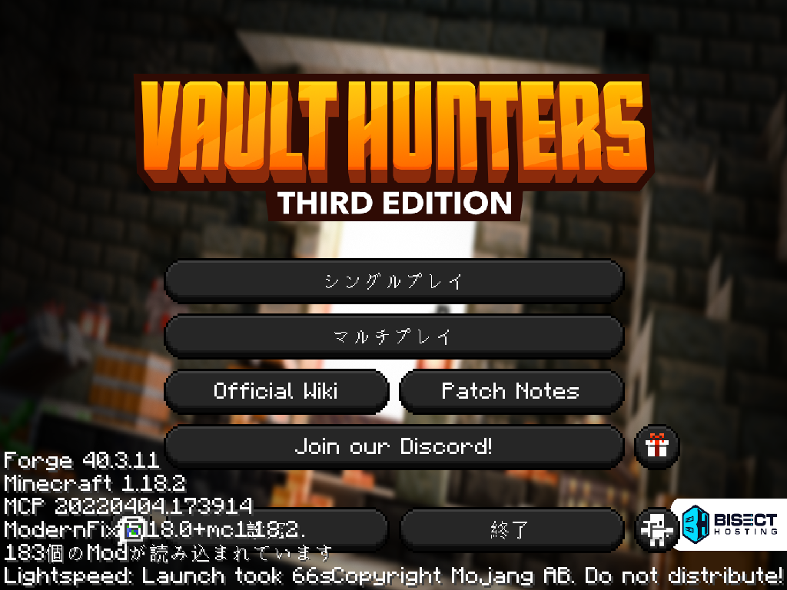
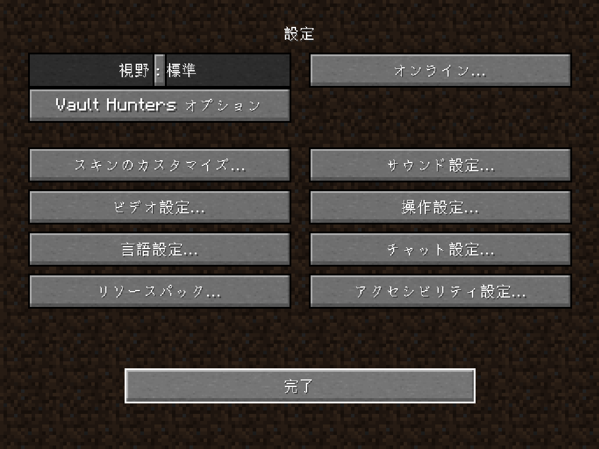
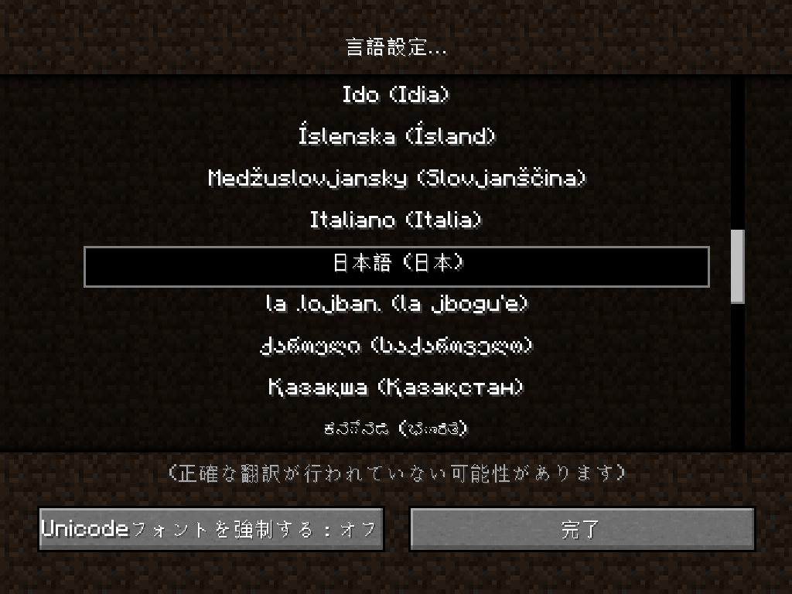
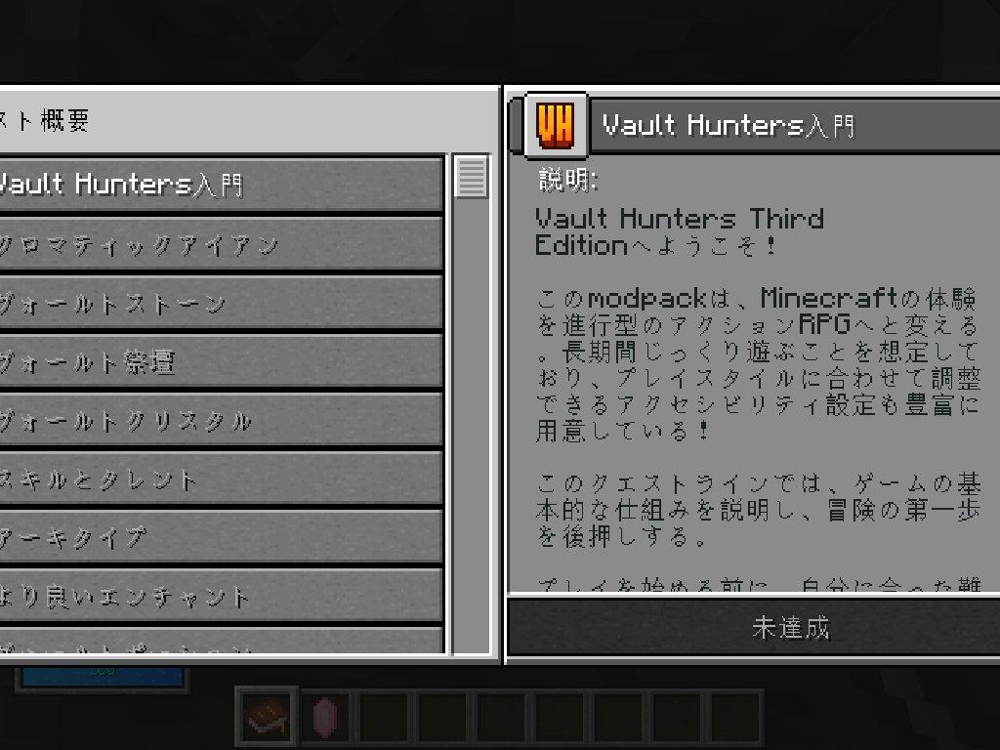

# Vault Hunters 3 Japanese Translation (日本語化)

Minecraftのmodpack「Vault Hunters 3rd Edition」(Minecraft 1.18.2 / Forge) を日本語で遊べるようにする、非公式の翻訳modです。訳文だけを同梱していて、原作のゲームデータは再配布していません。

**ダウンロード**: [GitHub Releases](https://github.com/matsumotory/minecraft-vault-hunters-3-japanese-translation/releases) / CurseForge (審査が終わりしだいリンクを載せます)

## これは何ですか

Vault Huntersは、スキルやクエストの説明文の多くをmod独自の場所に持っています。そのため、Minecraftの言語設定を日本語にしても、大部分が英語のまま残ります。このmodを入れると、次の表示文字列 約15,000件が日本語になります。

- アイテム名、ブロック名、ツールチップ
- スキル、アビリティ、クエストの説明文 (ゲームバランスの数値には一切触れません)
- 画面に直接書き込まれたUIの文字 (VaultPatcherというmodが実行時に置き換えます)
- ゲーム内ガイドブック

## 入れかた (CurseForgeアプリ)

2回起動するところまでが導入の手順です。順番どおりに進めてください。

1. CurseForgeアプリでVault Hunters Third Editionのプロファイルを開き、「コンテンツを追加する (Add More Content)」を押します
2. 「Vault Hunters 3 Japanese Translation」を検索して、インストールします。必要なVaultPatcherは、依存modとして自動で一緒に入ります
3. ゲームを起動します。この1回目の起動で、modが翻訳データをmodpackの中へ配置します
4. **ゲームをいったん終了して、もう一度起動します。** 画面に直接書き込まれたUIの文字の翻訳は、この2回目の起動から効きます (VaultPatcherが、ゲーム起動のいちばん最初に翻訳の設定を読むためです)
5. 次の「日本語になっているかの確認」で、翻訳が効いていることを確かめます

## 入れかた (手動)

1. [GitHub Releases](https://github.com/matsumotory/minecraft-vault-hunters-3-japanese-translation/releases) から `vhjapanese-*.jar` をダウンロードします
2. [VaultPatcher](https://www.curseforge.com/minecraft/mc-mods/vaultpatcher) のForge 1.18.2向けASM版もダウンロードします
3. 2つのjarを、インスタンスの `mods` フォルダへ入れます
4. CurseForgeアプリの場合と同じく、**ゲームを1回起動して終了し、もう一度起動します**

## 日本語になっているかの確認

3つの画面で確かめられます。

**1. タイトル画面** : メニューが「シングルプレイ」「マルチプレイ」と日本語になっていることを確かめます。

**2. 言語設定** : タイトル画面が英語のままのときは、Minecraftの言語設定が日本語になっていません。タイトル画面の「設定...」(Options...) を開くと、次の画面になります。

この中の「言語設定...」(Language...) を開き、一覧から「日本語 (日本)」を選んで「完了」を押します。

**3. クエストブック** : ワールドに入り、最初から持っているクエストブックを手に持って右クリックします。クエストの一覧と説明文が次のように日本語になっていれば、翻訳は正しく動いています。

## 翻訳されないときは

上から順に確かめてください。

1. **タイトル画面のメニューが英語のまま**: Minecraftの言語設定が日本語になっていません。上の「2. 言語設定」の手順で「日本語 (日本)」を選んでください
2. **アイテム名やクエストは日本語なのに、統計画面の項目名や一部のボタンだけ英語**: まだ1回目の起動です。ゲームを終了して、もう一度起動してください
3. **手動で入れたのに、すべて英語のまま**: `mods` フォルダに `vhjapanese-*.jar` と `vaultpatcher-*.jar` の2つが入っているか確かめてください
4. **アビリティ名 (Fireballなど)、神の名前 (Velaraなど)、統計画面の6つのラベル (Armorなど) が英語**: 故障ではありません。これらの名前はゲーム内部の識別子を兼ねていて、翻訳するとゲームが起動しなくなることを実機で確認したため、意図して英語のまま残しています
5. **それでも直らないとき**: [GitHub Issues](https://github.com/matsumotory/minecraft-vault-hunters-3-japanese-translation/issues) へ日本語で報告してください。インスタンスの `logs/latest.log` を添付してもらえると、原因をすぐに調べられます

## そのほかの仕様

- 翻訳が無い文字列は英語のまま表示されます。表示が英語に戻るだけで、ゲームは壊れません
- このmodは起動時に、書き換える前のconfigファイルを `config/vhjapanese/backup/` へ自動で保存します。元に戻したいときは、modを外してから、このバックアップのファイルを `config/the_vault/` へ書き戻してください

## 誤訳や不具合を見つけたら

[GitHub Issues](https://github.com/matsumotory/minecraft-vault-hunters-3-japanese-translation/issues) へ日本語で報告してください。誤訳は「どの画面の」「どの文字か」を書いてもらえると、早く直せます。

## 権利について

- Vault Huntersとthe_vaultは、Team Iskallia (85 Entertainment AB) の著作物です (All Rights Reserved)。このmodは非公式・非収益のファンプロジェクトで、原作のデータを複製していません。権利者から要請があれば、配布を取り下げます
- 日本語訳の一部は、MITライセンスの先行翻訳 [suzu2469/vault_hunter_lang_jp](https://github.com/suzu2469/vault_hunter_lang_jp) を土台にしています。どの部分がどれだけ先行翻訳に由来するかは、[NOTICE.md](NOTICE.md) の表に書いてあります
- このmodの実装と、当方が作成した訳文は、MITライセンスです ([LICENSE](LICENSE))

## English summary

Unofficial Japanese localization companion mod for the Vault Hunters 3rd Edition modpack (Minecraft 1.18.2 / Forge). Translations only; no original game content is redistributed. Install it from CurseForge and VaultPatcher will be pulled in automatically as a required dependency. After installing, launch the game once, quit, and launch it again: the hardcoded UI translations activate on the second launch, and everything else works from the first launch. Untranslated strings simply stay in English. Non-commercial fan project; we will take it down if the rights holder requests it. Our own work is MIT licensed. Parts build on the MIT licensed community translation by suzu2469 (see [NOTICE.md](NOTICE.md)).
